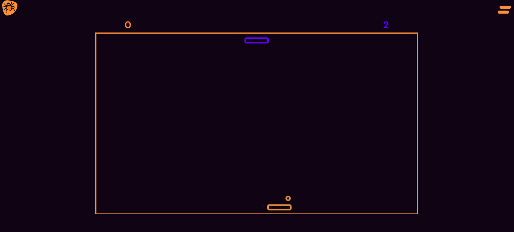

## __Hello!! Esse é o readme do projeto Pingue Pongue, codinome: Tarantulla__ 🙃🙂

Disponível no seguinte link: [https://lauanda1327.github.io/PinguePongue/](https://lauanda1327.github.io/PinguePongue/) 👈

Neste projeto você vai encontrar as seguintes linguagens:
HTML, CSS e JavaScript

- HTML para a estrutura
- CSS para a estilização
- JavaScript para a interação e lógica

Para esse projeto foi utilizado também o framework javascript p5.js para codificação artística visual, baseada em programação Javascript e Processing. O lado bom de utilizar esse framework é a possibilidade de criação de desenhos com código e a quantidade de linhas que ele 
 conseguiu diminui no codigo javascript. O p5.js também permite uma integração entre arquivos javascript o que é otimo para a organização do jogo, pois cada parte especifica do jogo ficará guardada em arquivos de script diferentes. No fim os arquivos serão chamados por um arquivo principal que é responável por junta todos os scripts e executar o jogo.

 [https://pinguePongue.io](https://lauanda1327.github.io/PinguePongue/)
 
 ### Isso é tudo...
